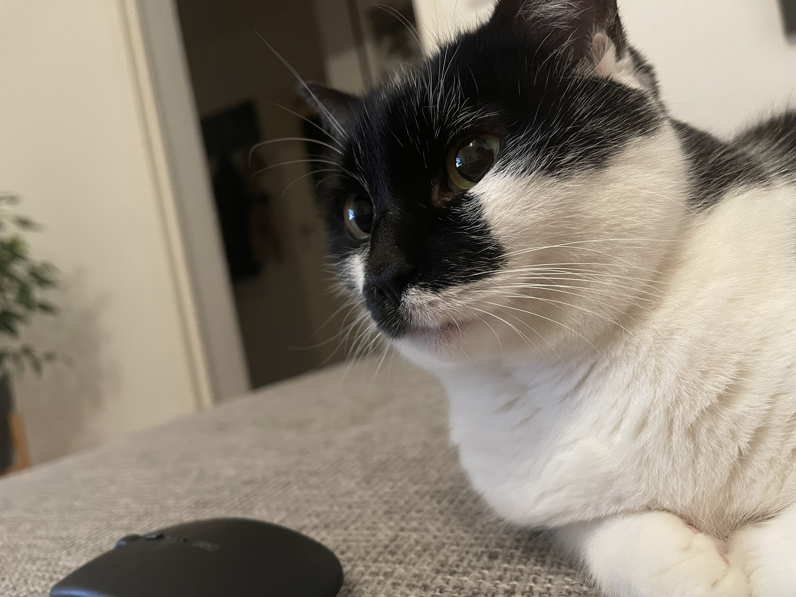

## DreamCanvas
### Description
DreamCanvas is a versatile mobile application that allows users to unleash their creativity by generating unique and artistic images from text inputs. The app provides a seamless experience with features like user authentication, image creation, model training, and account management.

### Features
##### User Authentication:

- Sign up for a new account.
- Log in with existing credentials.

##### Image Creation:
- Generate artistic images from text.
    
    
- Combine text with uploaded images to create unique compositions.
    
    
- Explore various artistic styles using Stablediffusion AI.
    

##### Model Training:
- Train your own models to customize image generation.
    
    
    
    
    

##### Account Management:
- Change password.
- Update first and last name.
- Delete your account.
    

##### Instructions:
- Read detailed instructions on using different features.
    

##### Image Management:
- View and manage created images.
- Save or delete images based on your preference.
    
    

### Technologies Used
1) Node.js
2) React Native
3) MySQL
5) Ngrok
6) Stablediffusion API

### Getting Started
##### Prerequisites
- Node.js installed
- MySQL database set up
- Stablediffusion API key

##### Installation
1) Clone the repository:
`git clone https://github.com/smurzz/dream-canvas-project.git`
2) Navigate to the backend directory:
`cd dream-canvas-project/sd-backend-app`
3) Install dependencies:
`npm install`
2) Navigate to the frontend directory:
`cd dream-canvas-project/sd-frontend-app`
3) Install dependencies:
`npm install`
4) Set up the database and configure environment variables in *_.env_*.
5) Start the application:
    * In _dream-canvas-project/sd-backend-app_ `npm dev run`
    * In _dream-canvas-project/sd-frontend-app_ `npm run web` or `npm run ios`.

### Usage
- Launch the app on your mobile device or emulator.
- Sign up or log in to your account.
- Explore different features, create images, and manage your account.

### Acknowledgments
Special thanks to the developers of Stablediffusion API.

### Contact
For any inquiries, please contact [Sofya Murzakova](murz.sophie@gmail.com).